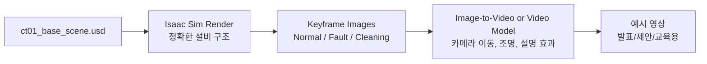

scene 생성 예시


가능합니다. 다만 목적에 따라 **3가지 방식**으로 구분하는 것이 좋습니다.

## 결론

`ct01_base_scene.usd`를 기반으로 예시 영상을 만들 수 있습니다.
가장 권장되는 방식은 **Isaac Sim에서 기준 장면을 렌더링하고, image/video generation model은 “설명용·시각화용 보강”에 사용하는 하이브리드 방식**입니다.

즉,



Isaac Sim은 robotics simulation, testing, synthetic data generation을 위한 Omniverse 기반 플랫폼이고, Replicator를 통해 RGB, depth, segmentation 등 synthetic data를 생성할 수 있습니다. 따라서 `ct01_base_scene.usd`를 기준 장면으로 두고 카메라 시점, 조명, 상태 variant를 바꿔 keyframe 이미지를 생성하는 것이 적합합니다. ([Isaac Sim Documentation][1])

---

## 1. 가능한 영상 유형

| 유형                                     |            가능 여부 |   권장도 | 설명                                                  |
| -------------------------------------- | ---------------: | ----: | --------------------------------------------------- |
| Isaac Sim 직접 렌더링 영상                    |               가능 | 매우 높음 | USD scene을 실제로 열고 카메라 path를 따라 frame rendering      |
| Isaac Sim keyframe + image/video model |               가능 |    높음 | 정확한 설비 구조는 Isaac Sim, 영상미·전환·설명은 생성형 모델             |
| 순수 text-to-video 생성                    |               가능 |    중간 | 빠른 컨셉 영상은 가능하지만 실제 USD 구조와 다를 수 있음                  |
| 학습용 ground-truth 영상                    | Isaac Sim 기반만 권장 | 매우 높음 | segmentation, depth, metadata가 필요하므로 생성형 영상만으로는 부적합 |

OpenAI Sora 같은 text-to-video 모델은 텍스트 프롬프트로 최대 1분 길이의 영상을 생성할 수 있다고 소개되어 있지만, 수처리 설비의 정확한 배관 위치, sensor tag, actuator 상태 같은 engineering fidelity는 Isaac Sim 렌더링 기반이 더 적합합니다. ([OpenAI][2])

---

## 2. 권장 제작 방식

### 방식 A. Isaac Sim 기반 정확한 예시 영상

이 방식은 **가장 기술적으로 신뢰도 높은 방식**입니다.

```text id="kyi8qq"
ct01_base_scene.usd
→ Isaac Sim에서 scene load
→ camera path 설정
→ actuator state animation
→ scenario별 material/metadata 변경
→ frame sequence 저장
→ ffmpeg로 mp4 생성
```

예시 장면 구성은 다음과 같습니다.

| 구간     | 장면                         | 설명                                            |
| ------ | -------------------------- | --------------------------------------------- |
| 0~5초   | 냉각탑 전체 topdown view        | CT-01 전체 구조 소개                                |
| 5~10초  | basin, fan, piping zoom-in | 주요 설비 구성                                      |
| 10~15초 | sensor overlay             | pH, ORP, conductivity, turbidity sensor 위치 표시 |
| 15~22초 | actuator overlay           | blowdown valve, dosing pump, make-up valve 표시 |
| 22~30초 | 정상 운전                      | COC 안정, residual 정상, pH 정상                    |
| 30~40초 | 이상상황                       | conductivity 상승 + blowdown valve stuck        |
| 40~50초 | reasoning result           | Sensor Context Reasoning Model이 root cause 판단 |
| 50~60초 | Validator/PLC/MPC/작업자 승인   | 안전 검증 후 actuator 수행 흐름                        |

---

## 3. Image Generation Model을 활용하는 방식

Image generation model은 다음 용도에 적합합니다.

| 활용                    | 설명                                                           |
| --------------------- | ------------------------------------------------------------ |
| Concept art           | 냉각탑 digital twin의 고품질 예시 장면 생성                               |
| Storyboard            | 영상 제작 전 장면별 시안 작성                                            |
| Visual enhancement    | Isaac Sim 렌더링에 조명, 색감, 설명 패널 스타일 보강                          |
| Scenario illustration | biofilm, corrosion, leak, emergency cleaning 상황을 설명용 이미지로 표현 |
| Presentation video    | 제안발표용 30~60초 설명 영상 제작                                        |

하지만 image generation model만으로 만든 영상은 **실제 `ct01_base_scene.usd`의 geometry, sensor position, actuator tag를 보장하지 못합니다.** 그래서 학습용 데이터 또는 기술 검증용 영상에는 Isaac Sim 렌더링을 기준으로 사용해야 합니다.

---

## 4. 예시 영상 시나리오 설계

### 제목

```text id="0bzx7o"
Cooling Tower Sensor Context Reasoning Simulation
```

### 영상 메시지

```text id="pgwd4a"
실제 현장 데이터 반출 없이,
Isaac Sim 기반 Cooling Tower USD Scene과 Synthetic Data Simulation을 활용하여
수질 센서 context, actuator 상태, fault scenario를 재현하고,
Sensor Context Reasoning Model을 학습·검증한다.
```

### 장면 구성

| Scene    | 화면             | 핵심 메시지                                          |
| -------- | -------------- | ----------------------------------------------- |
| Scene 1  | 냉각탑 전체 3D view | CT-01 Digital Twin                              |
| Scene 2  | sensor 위치 표시   | pH, ORP, Conductivity, Turbidity, Flow          |
| Scene 3  | actuator 위치 표시 | Blowdown Valve, Dosing Pump, Make-up Valve      |
| Scene 4  | 정상 운전          | Stable COC / Residual / pH                      |
| Scene 5  | 이상 발생          | Conductivity 상승, ORP 하락, pH 상승                  |
| Scene 6  | root cause 추론  | Blowdown valve stuck + biocide effectiveness 저하 |
| Scene 7  | Validator 판단   | No-flow dosing 금지, max dose, pH 보정              |
| Scene 8  | 작업자 승인         | High-risk action approval                       |
| Scene 9  | PLC/MPC 실행     | Blowdown, dosing, pH correction                 |
| Scene 10 | 결과 확인          | Risk score 감소, 정상범위 회복                          |

---

## 5. Image/Video Generation용 프롬프트 예시

### 프롬프트 1. 전체 냉각탑 Digital Twin

```text id="5x39my"
Create a high-fidelity industrial digital twin visualization of a cooling tower water treatment system. 
Show the cooling tower body, basin, fan stack, recirculation pipes, make-up water line, blowdown valve, chemical dosing skid, pH sensor, ORP sensor, conductivity sensor, turbidity sensor, and level sensor. 
Style: realistic NVIDIA Isaac Sim / OpenUSD engineering simulation, clean industrial environment, top-down camera, technical labels, blue-gray color palette, suitable for AI system proposal presentation.
```

### 프롬프트 2. Sensor Context Reasoning 장면

```text id="gb3yzv"
Create a cinematic technical visualization of a cooling tower sensor context reasoning system. 
Overlay live sensor values: pH 8.7, conductivity 2550 uS/cm, ORP 410 mV, free chlorine 0.15 mg/L, turbidity 8.1 NTU. 
Highlight a stuck blowdown valve and low biocide effectiveness. 
Show AI reasoning panels: high biofilm risk, scale risk, root cause candidate, recommended action. 
Style: industrial digital twin, realistic simulation, dashboard overlay, clean Korean enterprise AI presentation style.
```

### 프롬프트 3. Validator/PLC/MPC/작업자 승인 장면

```text id="s0heoc"
Create an industrial AI control safety workflow scene for a cooling tower water treatment system. 
Show a multi-layer control flow: Sensor Context Reasoning Model, Validator, MPC, PLC, Operator Approval, Actuators. 
The actuators include blowdown valve, biocide dosing pump, acid dosing pump, make-up valve, and fan VFD. 
Emphasize that AI does not directly control actuators; commands pass through safety validation and operator approval. 
Style: realistic digital twin with transparent control overlay, professional engineering proposal visual.
```

---

## 6. 실제 제작 파이프라인 제안

### 1단계: Isaac Sim에서 기준 이미지 생성

`ct01_base_scene.usd`를 열고 다음 카메라 이미지를 생성합니다.

```text id="v2ux4c"
frames/
├── 000_topdown_base.png
├── 001_sensor_overlay.png
├── 002_actuator_overlay.png
├── 003_normal_operation.png
├── 004_high_coc_fault.png
├── 005_blowdown_valve_failure.png
├── 006_reasoning_overlay.png
├── 007_validator_workflow.png
├── 008_operator_approval.png
└── 009_recovered_operation.png
```

### 2단계: 이미지 생성 모델로 보강

Isaac Sim 렌더링 이미지를 기준으로 다음을 보강합니다.

| 보강 요소       | 목적                          |
| ----------- | --------------------------- |
| 설명 패널       | 발표용 가독성 향상                  |
| 센서값 overlay | sensor context reasoning 설명 |
| 색상 강조       | 위험도 high/medium/normal 구분   |
| 조명/카메라 연출   | 제안발표 영상 품질 향상               |
| 배경 정리       | 시각적 복잡도 감소                  |

### 3단계: 영상화

두 가지 방식이 가능합니다.

| 방식                    | 설명                              |
| --------------------- | ------------------------------- |
| ffmpeg frame sequence | Isaac Sim에서 생성한 frame을 mp4로 변환  |
| image-to-video model  | keyframe 이미지를 입력해 카메라 이동과 전환 생성 |

학습용 데이터셋은 Isaac Sim/Replicator 기반으로 생성하고, 발표용 영상은 image/video generation model을 활용해 보강하는 방식이 가장 안전합니다. Isaac Sim Replicator는 SDG workflow를 지원하고, 2026년 문서 기준 Synthetic Data Recorder도 custom writer로 다양한 포맷 기록을 지원합니다. ([Isaac Sim Documentation][1])

---

## 7. 최종 권장안

`ct01_base_scene.usd` 예시 영상은 다음 구조로 제작하는 것이 가장 좋습니다.

```text id="h04hr6"
기술 검증용:
Isaac Sim render only
→ 정확한 geometry, sensor, actuator, metadata 보장

제안발표용:
Isaac Sim render + image/video generation model
→ 정확성 + 시각적 설득력 확보

컨셉 데모용:
text/image-to-video generation
→ 빠른 시안 제작, 단 engineering fidelity는 낮음
```

따라서 현재 단계에서는 **30~60초 분량의 제안발표용 컨셉 영상**을 목표로 잡고,

1. `ct01_base_scene.usd` 기준 장면 설계
2. 10개 keyframe 이미지 생성
3. sensor/actuator/reasoning overlay 추가
4. image-to-video 또는 ffmpeg로 영상화

순서로 진행하는 것이 적합합니다.

[1]: https://docs.isaacsim.omniverse.nvidia.com/5.1.0/synthetic_data_generation/index.html?utm_source=chatgpt.com "Synthetic Data Generation - Isaac Sim Documentation - NVIDIA"
[2]: https://openai.com/index/sora/?utm_source=chatgpt.com "Sora: Creating video from text"
